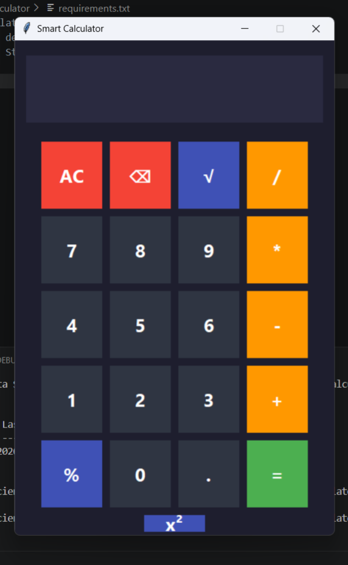

# 🧮 Smart Calculator

A modern **Python Smart Calculator** developed using **Tkinter** with a clean dark-themed graphical interface.

This project demonstrates the fundamentals of Python programming, GUI development, event-driven programming, and exception handling. It is the first project in the **Data-Science-Mastery** repository.

---

# 📌 Project Information

| Attribute | Details |
|-----------|---------|
| Project Name | Smart Calculator |
| Difficulty | Beginner |
| Category | Python Fundamentals |
| Language | Python 3 |
| GUI Framework | Tkinter |
| Author | Devika M |
| Repository | Data-Science-Mastery |

---

# 🚀 Features

### Basic Arithmetic

- Addition
- Subtraction
- Multiplication
- Division

### Advanced Operations

- Square Root
- Percentage
- Decimal Support
- Clear Screen
- Delete Last Character

### Error Handling

- Division by Zero
- Invalid Expressions
- Empty Input Validation

### User Interface

- Modern Dark Theme
- Large Responsive Buttons
- Easy-to-use Layout
- Real-time Display
- Keyboard-friendly Interface

---

# 📚 Concepts Covered

This project demonstrates the following Python concepts:

- Variables
- Data Types
- Operators
- User Input
- Functions
- Conditional Statements
- Exception Handling
- Modules
- Event Handling
- GUI Programming
- Object-Oriented Design (Optional Extension)
- Tkinter Widgets
- Lambda Functions

---

# 🛠 Technologies Used

- Python 3.13
- Tkinter
- Math Module
- VS Code
- Git
- GitHub

---

# 📂 Project Structure

```
01_Smart_Calculator
│
├── calculator.py
├── README.md
├── requirements.txt
├── output.txt
│
├── screenshots
│   ├── calculator_screenshot.png
│   ├── Screenshot (6).png
│   └── Screenshot (7).png
│
└── assets
```

---

# ▶️ Installation

Clone the repository

```bash
git clone https://github.com/Devikadev626/Data-Science-Mastery.git
```

Navigate to the project

```bash
cd Data-Science-Mastery/01_Python/01_Smart_Calculator
```

Create Virtual Environment

Windows

```bash
py -m venv .venv
```

Activate

PowerShell

```powershell
.\.venv\Scripts\Activate.ps1
```

Install dependencies

```bash
pip install -r requirements.txt
```

---

# ▶️ Run the Project

```bash
py calculator.py
```

---

# 📸 Screenshots

## Calculator Interface



---

# 📖 Learning Outcomes

After completing this project you will understand:

- Python Programming Basics
- Tkinter GUI Development
- Button Event Handling
- Calculator Logic
- Error Handling
- Layout Management
- Python Functions
- User Interface Design

---

# 📈 Future Improvements

Some ideas to enhance this calculator:

- Scientific Calculator
- Light/Dark Theme Toggle
- Calculation History
- Keyboard Shortcuts
- Copy Result
- Memory Functions
- Unit Converter
- Currency Converter
- Voice Input
- Expression Parser
- Calculator Themes

---

# 💡 Skills Demonstrated

- Python Programming
- GUI Development
- Problem Solving
- Software Design
- Clean Code Practices
- Git Version Control
- GitHub Project Management

---

# 📄 License

This project is released under the MIT License.

---

# ⭐ Repository

If you found this project useful, consider giving the repository a ⭐.

GitHub Repository:

**https://github.com/Devikadev626/Data-Science-Mastery**

---

## 👩‍💻 Author

**Devika M**

AI Engineer | Data Scientist | Data Analytics Trainer

GitHub:
https://github.com/Devikadev626

---

### Data-Science-Mastery Roadmap

- ✅ Project 01 — Smart Calculator
- ⏳ Project 02 — Student Grade Calculator
- ⏳ Project 03 — Password Generator
- ⏳ Project 04 — Number Guessing Game
- ⏳ Project 05 — To-Do List App
- ⏳ Project 06 — Expense Tracker
- ⏳ Project 07 — Library Management System
- ⏳ Project 08 — Weather App
- ⏳ Project 09 — File Organizer
- ⏳ Project 10 — Chat Application

---

**Built with Python ❤️**