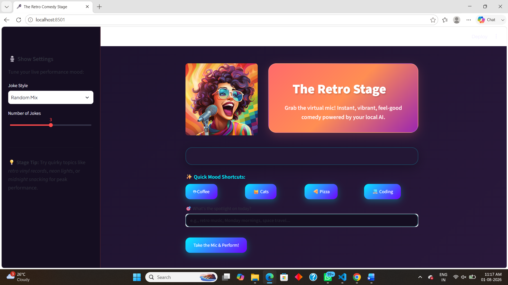
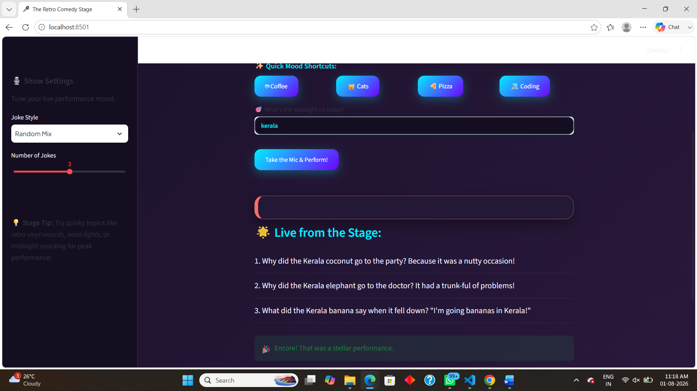
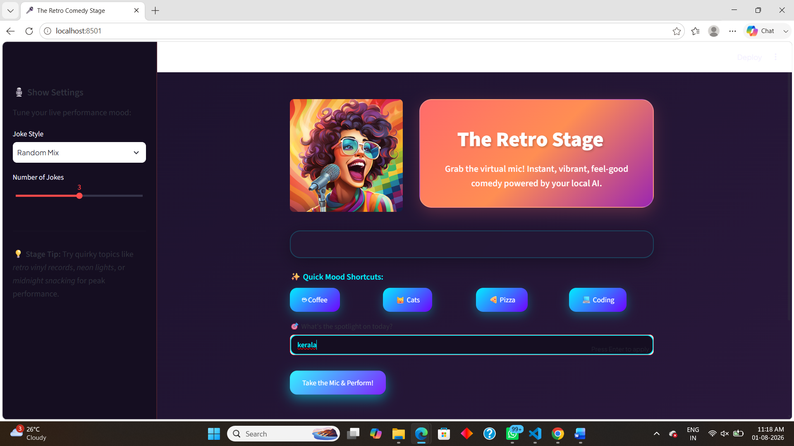

# AI Joke Generator using Python, Ollama & Streamlit

An AI-powered Joke Generator that runs entirely on your local machine using Ollama and Llama 3.2. This project demonstrates how to integrate a Large Language Model (LLM) into a Python application with a modern Streamlit user interface featuring a vibrant retro-pop aesthetic.

---

## 🎨 Application Preview

### Application Home


### Loading Screen


### Quick Topics


---

## Project Overview

The AI Joke Generator is a beginner-friendly AI Engineering project designed to introduce students to Large Language Models (LLMs), Prompt Engineering, and local AI application development.

Users can enter any topic, choose a joke style, and specify the number of jokes to generate. The application crafts a structured prompt enforcing simple, easy-to-understand English, sends it to the locally running Llama 3.2 model through Ollama, and displays the generated jokes inside custom-styled interactive Streamlit cards.

Unlike cloud-based AI applications, this project runs completely offline after the model is downloaded, providing total data privacy and eliminating API costs.

---

## Features

* Local AI inference using Ollama
* Llama 3.2 Large Language Model integration
* Interactive Streamlit interface with a retro-pop stage theme
* Custom CSS styling (plum, electric teal, and coral accents)
* Multiple joke styles (Programming, Dad Jokes, One-Liners, etc.)
* Configurable number of jokes via sliders
* Quick topic shortcut buttons using Session State
* Strict prompt engineering for simple, clear English and family-friendly humor
* User input validation and comprehensive exception handling
* Fully offline execution capability

---

## Technologies Used

| Technology | Purpose |
| :--- | :--- |
| **Python** | Core programming language |
| **Streamlit** | User Interface framework |
| **Ollama** | Local LLM Runtime |
| **Llama 3.2** | Large Language Model |
| **HTML & CSS** | Custom UI Styling |
| **Git & GitHub** | Version Control |

---

## Project Structure

```text
01_AI_Joke_Generator/
│
├── app.py
├── README.md
├── requirements.txt
├── .gitignore
│
├── assets/
├── docs/
└── images/
    ├── home_page.png
    ├── loading_screen.png
    └── topics.png


Project Workflow
Plaintext
User 
  │
  ▼
Enter Topic / Quick Shortcut
  │
  ▼
Select Joke Style & Count
  │
  ▼
Python Constructs Simple-English Prompt
  │
  ▼
Ollama (Local Server)
  │
  ▼
Llama 3.2 Model Inference
  │
  ▼
AI Generates Jokes
  │
  ▼
Streamlit Renders Styled Cards
Installation & Setup
1. Clone the Repository
Bash
git clone [https://github.com/Devikadev626/Data-Science-Mastery.git](https://github.com/Devikadev626/Data-Science-Mastery.git)
2. Navigate to the Project Folder
Bash
cd Data-Science-Mastery/12_AI_Engineering/01_AI_Joke_Generator
3. Create & Activate Virtual Environment (Windows PowerShell)
Bash
python -m venv .venv
.venv\Scripts\Activate
4. Install Dependencies
Bash
pip install -r requirements.txt
5. Install & Setup Ollama
Download and install Ollama from ollama.com.

Verify the installation:

Bash
ollama --version
Pull the Llama 3.2 model:

Bash
ollama pull llama3.2
Running the Application
Ensure Ollama is running in the background.

Run the Streamlit application:

Bash
streamlit run app.py
Open your browser at http://localhost:8501 if it does not launch automatically.

Daily Startup Checklist
Whenever you return to work on this project:

Open VS Code and open folder 01_AI_Joke_Generator.

Open the Integrated Terminal (`Ctrl + ``).

Activate the virtual environment:

Bash
.venv\Scripts\Activate
Confirm Ollama is running or active.

Run the app:

Bash
streamlit run app.py
Access via http://localhost:8501. (Use Ctrl + F5 for a hard browser refresh if styling changes fail to render).

AI Concepts Demonstrated
Large Language Models (LLMs): Utilizing pre-trained neural networks for text generation.

Prompt Engineering: Crafting precise instruction sets enforcing simple English constraints, brevity, and family-friendly tone.

Local AI Deployment: Running inference locally on hardware using Ollama without third-party cloud dependencies.

Streamlit State Management: Preserving quick-mood button states across application reruns using st.session_state.

Robust Error Handling: Implementing try-except blocks to gracefully catch disconnected local server exceptions.

Author
Devika M

Territory Technical Head – IT

AI Engineer | Data Science Trainer | AI Educator

GitHub: https://github.com/Devikadev626

License
Released for educational and learning purposes under the Data-Science-Mastery curriculum.